# Robot Setup 机器人校准软件

## 1. 软件功能

软件支持以下机器人配置和验证任务：

| 功能 | 说明 |
| --- | --- |
| 连接确认 | 确认机器人已上电，并建立稳定的通信连接。 |
| 设备检查 | 检查机器人控制链路、关节和电机设备是否与预期一致。 |
| 通信质量验证 | 对机器人通信质量进行持续测试并输出测试结果。 |
| 关节校准 | 完成关节零位、运动范围和限位检查。 |
| 姿态传感器检测 | 验证 IMU 等姿态传感器的姿态数据和活动范围。 |
| 运动验证 | 在 Robot Setup 中通过软件按钮启动预设动作，完成整机运动和通信验证，并由软件分析测试结果。 |
| 电机 ID 设置 | 在装配完成后检查并修改指定电机的 ID。该功能是独立功能分支。 |
| 运动数据导出 | 将当前机器人型号对应的动作数据导出为可复用的 `play.csv` 文件。 |
| 独立耐久测试 | 使用单独的 `emcli play` 工具循环播放导出的动作数据。 |

校准结果和设备配置会保存在本机，便于后续继续配置或再次验证。

## 2. 交付包说明

请在Release中下载打包文件，仓库中不包含具体机器人配置，压缩包解压后结构如下：

```text
dist/
├── install_robot_setup.sh
└── robot_setup-installer.tar.gz
```

| 文件 | 用途 |
| --- | --- |
| `install_robot_setup.sh` | 图形化安装入口。 |
| `robot_setup-installer.tar.gz` | 软件程序、机器人型号配置、资源文件和运行组件。 |

安装完成后，软件会安装到当前用户的主文件夹，并在桌面创建 `Robot Setup` 启动图标。

请勿单独修改、拆分或替换发布目录中的文件。若需要更换版本，请使用完整的新发布包进行升级或重新安装。

## 3. 运行条件

### 3.1 计算机环境

- 带桌面环境的 Linux 计算机，当前发布包面向 Ubuntu 系列系统设计。
- 可正常使用文件管理器和浏览器。
- 当前用户具备软件安装所需的系统授权；部分运行组件安装时会弹出系统认证窗口。
- 首次安装时建议保持网络连接，以便安装程序准备运行环境。

### 3.2 机器人和现场条件

- 机器人已完成机械安装，并按照产品要求固定。
- 机器人电源、通信线缆和计算机接口已准备就绪。
- 机器人运动区域内没有人员、杂物或可能造成碰撞的设备。
- 急停装置和现场安全联锁处于可用状态。
- 进行运动验证时，应由现场安全负责人确认可以开始测试。

## 4. 安装软件

1. 在文件管理器中打开发布包内的 `dist` 文件夹。
2. 双击或通过文件管理器的运行选项打开 `install_robot_setup.sh`。
3. 按系统提示完成安装，并等待安装过程结束。
4. 安装成功后，确认桌面出现 `Robot Setup` 图标。

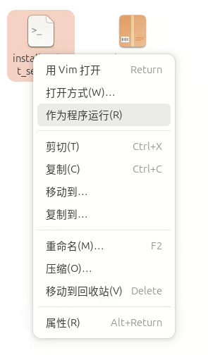

如果系统阻止安装入口运行，请打开该文件的属性，在权限设置中启用“允许作为程序执行”或同等选项，然后重新打开安装入口。

如果目标安装目录中已经存在旧版本，安装程序会在升级过程中临时备份旧版本，并尽量保留已有设备配置和未完成进度。升级失败时，安装程序会尝试恢复旧版本。升级前仍建议保留重要配置和日志备份。

## 5. 启动软件

1. 双击桌面上的 `Robot Setup` 图标。
2. 等待浏览器打开机器人配置页面。
3. 如果系统首次询问是否信任或允许运行该启动图标，请选择允许。

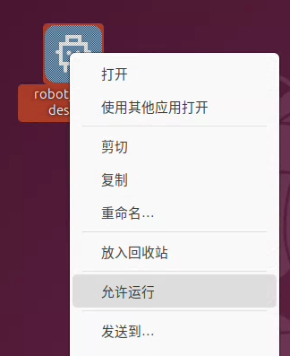

软件默认使用本机浏览器页面提供服务。如果浏览器没有自动打开，可在浏览器地址栏输入：

```text
http://127.0.0.1:8080
```

该地址仅用于当前计算机本地访问。

启动后首页会根据当前设备状态显示可用功能，例如安装与初始化、电机 ID 设置、机器人整体配置和运动数据导出。


## 6. 首次配置流程

首次启动后，进入 **安装与初始化** 页面。


### 6.1 运行环境检查

软件会先检查当前计算机是否具备运行机器人配置所需的组件。进入检查页面后，选择 **检查**，等待检查结果。

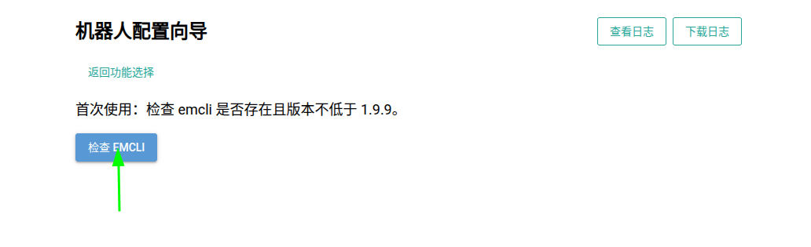

如果运行环境已经准备完成，软件会进入后续配置流程。如果缺少必要组件，页面会提供运行组件安装入口。

### 6.2 运行组件安装与系统授权

运行组件缺失时，选择页面中的安装选项，等待安装程序完成准备工作。

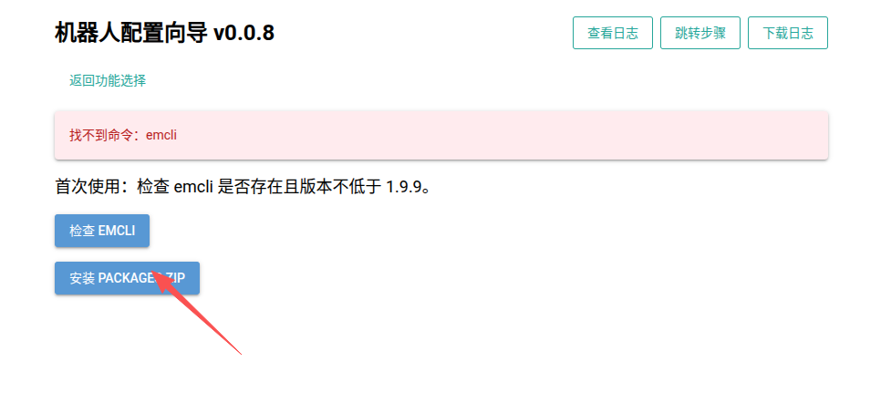

安装系统组件时，操作系统可能显示权限确认窗口。请确认操作来源为本软件安装流程，然后输入具备安装权限的用户密码并确认。

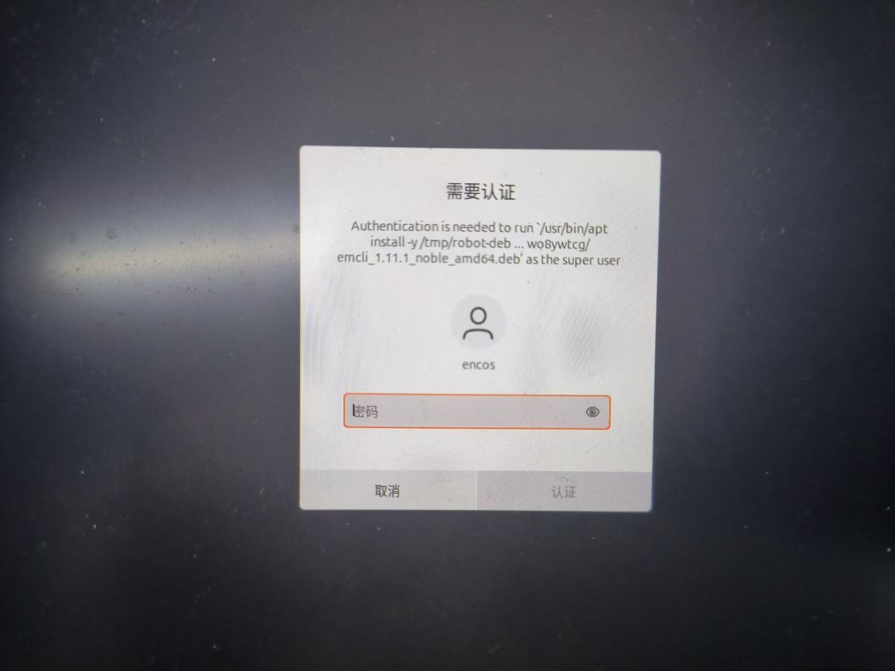


### 6.3 选择机器人型号

根据交付的机器人型号选择对应配置。型号选择会影响关节数量、关节名称、校准范围和运动轨迹，请在配置前确认型号与实际设备一致。

### 6.4 识别机器人通信连接

软件会引导用户完成通信接口识别：

1. 按页面提示暂时断开机器人通信线缆与计算机的连接。
2. 选择页面中的接口识别操作。
3. 按页面提示恢复通信线缆连接并开启机器人电源。
4. 等待机器人系统稳定后，继续进行连接识别。

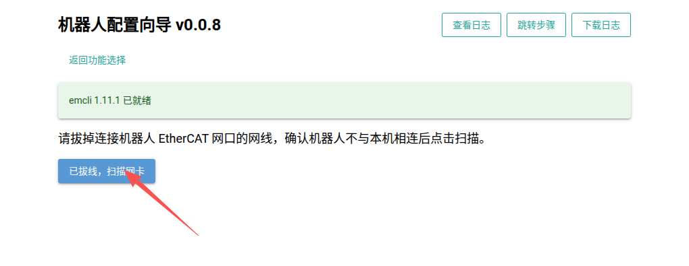

该步骤用于避免选择错误的网络接口。识别过程中，请避免同时接入其他临时网络设备。

## 7. 日常使用

机器人完成首次配置后，可以从首页进入以下功能分支：

- **电机 ID 设置**：独立于机器人整体配置，用于在装配后发现电机 ID 不正确时，将指定电机修改为目标关节所需的 ID。
- **机器人整体配置**：重新执行连接确认、设备检查、通信质量验证、关节校准、姿态传感器检测或运动验证。
- **运动数据导出**：将当前型号的动作数据生成并保存到指定目录。


### 7.1 电机 ID 设置

当机器人装配完成后，发现某个关节上的电机 ID 与要求不一致，可以使用此功能进行修改。

以 **左髋俯仰** 关节为例：假设该关节要求使用电机 ID `1`，但实际连接的电机当前 ID 为 `10`。

1. 在首页点击 **电机 ID 设置**。
2. 点击目标关节 **左髋俯仰**。
3. 软件扫描当前网卡上挂载的电机，并弹出设备选择窗口。窗口中的格式为 `总线:电机ID`，例如 `0:1` 表示当前总线 `0` 上 ID 为 `1` 的电机。
4. 在列表中点击实际连接到左髋俯仰关节、当前 ID 为 `10` 的电机，即选择 `0:10`。
5. 软件会将选中的电机 ID 修改为左髋俯仰关节所需的目标 ID `1`。页面提示设置成功后，按提示重启电机。

如果实际要修改的电机当前显示为 `0:1`，则点击 `0:1`；请根据电机当前实际显示的总线和 ID 选择对应项目。

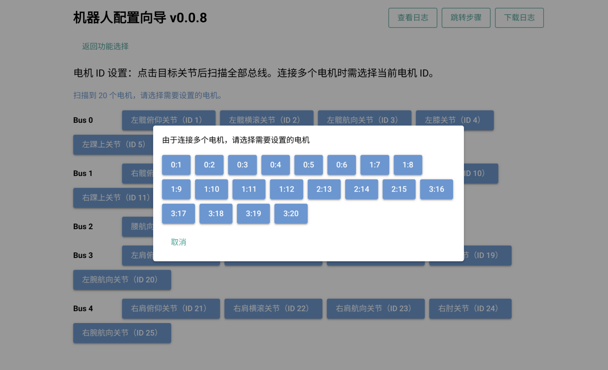

### 7.2 机器人配置与验证

通信连接识别完成后，软件会按顺序进入以下阶段：

1. **连接确认**：确认机器人在线并保持稳定连接。
2. **设备检查**：检查关节、电机和设备拓扑是否符合预期。
3. **通信质量验证**：评估连接稳定性和通信质量。
4. **关节校准**：完成零位、运动范围和限位检查。
5. **姿态传感器检测**：确认 IMU 姿态数据满足要求。
6. **运动验证**：点击 **开始运动测试** 后，Robot Setup 在后台执行预设轨迹，完成整机运动和通信验证，并显示测试结果。

每个阶段完成后，软件会显示对应结果。某阶段未通过时，应先根据页面提示检查设备和现场条件，再重新执行该阶段。

#### 7.2.1 配置进度恢复

如果上次配置未完成，软件会提示是否恢复进度：

- 选择 **恢复上次进度**，继续未完成的配置。
- 选择 **放弃并重新开始**，重新执行完整流程。

如果无法判断应选哪一项，建议保留当前进度并联系软件提供方确认。

#### 7.2.2 维护人员进度跳转

页面右上角的 **跳转步骤** 用于授权维护和故障定位。普通配置流程不需要使用该功能。

使用时：

1. 选择 **跳转步骤**。
2. 在管理员验证窗口中输入维护权限密码。
3. 选择目标大步骤、关节或子步骤。
4. 点击 **跳转**。

该功能可能改变当前配置进度，只应由经过授权的维护人员使用。

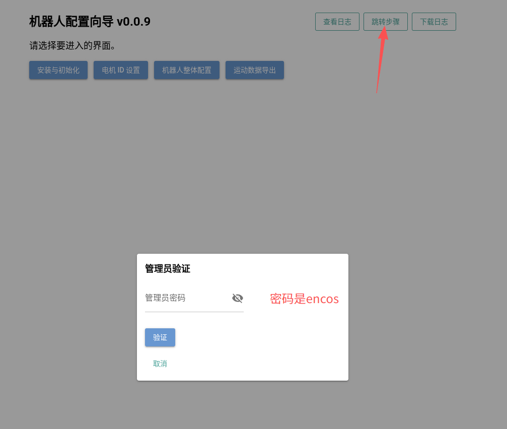

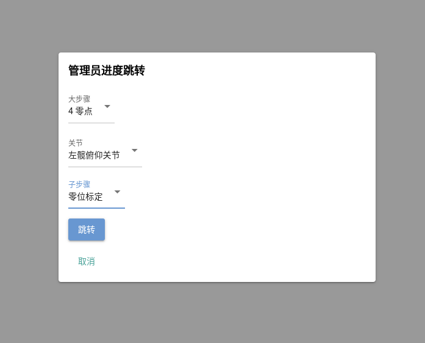

### 7.3 运动数据导出

完成机器人型号选择和通信连接配置后，到首页 **运动数据导出**。该功能用于将当前机器人型号对应的动作数据导出到指定目录，供独立的 `emcli play` 耐久测试使用。

1. 点击 **运动数据导出**。
2. 在 **导出目录** 中选择目标文件夹；可以通过 **进入** 和目录列表进入下一级目录。
3. 在 **文件名** 中确认文件名，默认名称为 `play.csv`。
4. 点击 **导出**。

导出时，软件会根据当前设备配置生成可用的动作数据文件。

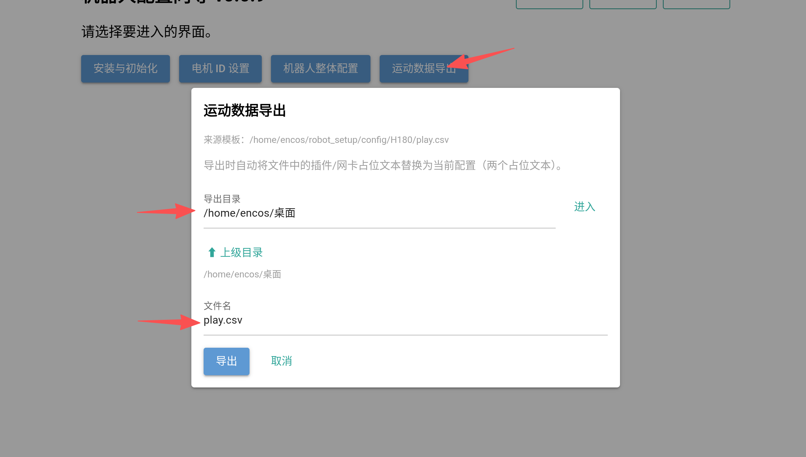

#### 7.3.1 使用 `emcli play` 进行独立耐久测试

`emcli play` 是独立于 Robot Setup 图形界面的命令行工具，用于循环播放导出的 `play.csv`，执行机器人耐久测试。它不属于 Robot Setup 的常规配置流程。

开始测试前，请确认机器人已正确安装和固定，运动区域内无人、无障碍物。

1. 在 Robot Setup 首页点击 **运动数据导出**，生成当前机器人对应的 `play.csv`。
2. 打开保存 `play.csv` 的文件夹。
3. 在该文件夹中打开终端，执行以下完整命令：

```bash
emcli play ./play.csv --endless --max-current 25 --log=./logs
```

其中，`--endless` 表示循环播放，`--max-current 25` 表示设置最大电流为25A，`-log ./logs` 启动日志--log后面跟的日志保存路径。

耐久测试结束时，在终端中按 **Ctrl+C** 停止播放。手动播放的界面示例如下：

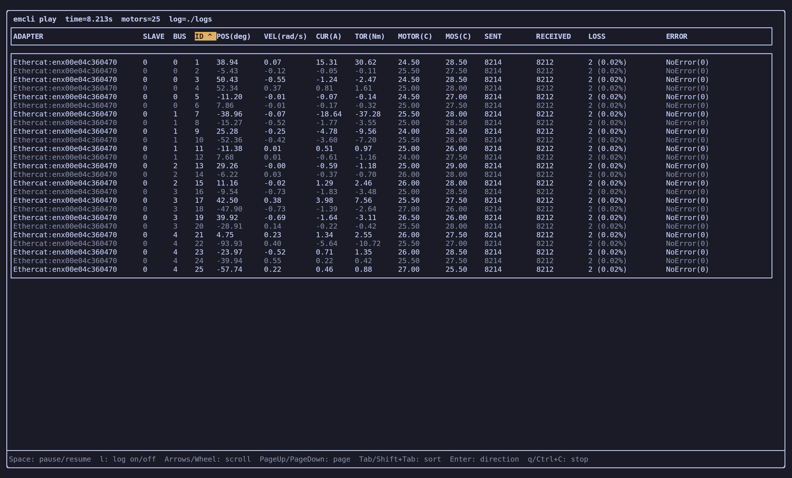

界面底部显示了播放过程中的快捷键操作：

| 快捷键 | 操作 |
| --- | --- |
| `Space` | 暂停或继续播放。 |
| `l` | 开启或关闭电机日志记录。 |
| 方向键 / 鼠标滚轮 | 在电机状态列表中上下滚动查看。 |
| `PageUp` / `PageDown` | 按页查看电机状态列表。 |
| `Tab` / `Shift+Tab` | 切换排序项目。 |
| `Enter` | 切换当前排序方向。 |
| `q` / `Ctrl+C` | 停止动作播放。 |

该文件夹中包含各电机的动作和状态日志文件：

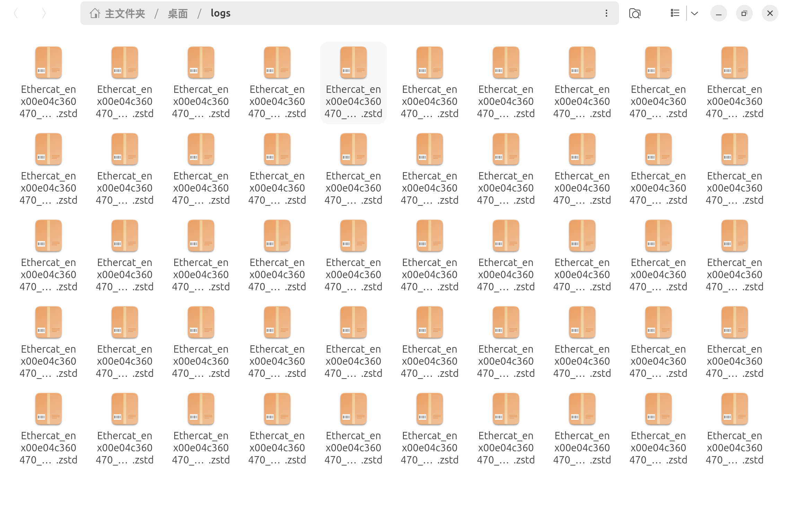

## 8. 安全和使用要求

- 只有经过客户现场培训并获得授权的人员，才可以执行机器人配置和运动验证。
- 运动验证前，必须确认机器人安装状态、周边空间和急停装置均正常。
- 机器人运行期间，不得进入机器人活动范围，不得触碰运动部件。
- 通信质量测试和运动验证期间，不要随意插拔通信线缆或关闭机器人电源。
- 如果发现异常声音、异常姿态、通信中断或其他不安全情况，应立即使用现场急停装置，并按现场安全流程处理。
- 软件页面显示的“通过”只代表软件检测结果，不替代机械、电气和安全验收。

## 9. 日志和故障处理

### 9.1 日志获取

软件页面提供以下功能：

- **查看日志**：查看最近的运行记录和检测结果。
- **下载日志**：将运行记录保存为日志文件，供客户 IT 或软件提供方分析。

Robot Setup 内置运动验证完成后，软件页面会显示各关节检测结果，包括丢包率、跟踪误差、连续超差时间和电机温度。右上角 **下载日志** 导出的 `.log` 文件用于保存软件运行记录。

发生异常时，建议记录以下信息后再联系支持人员：

1. 当前机器人型号。
2. 当前配置阶段。
3. 页面显示的完整提示信息。
4. 相关设备或线缆状态。
5. 软件导出的日志文件。

### 9.2 常见问题

| 现象 | 建议处理 |
| --- | --- |
| 软件无法启动 | 确认桌面启动图标已允许运行；重新打开图标。 |
| 运行环境检查未通过 | 重新执行环境检查和运行组件安装；涉及系统权限时请由 IT 管理员确认。 |
| 未识别到机器人连接 | 检查机器人电源、通信线缆和计算机接口，确认没有选择错误的通信接口后重新识别。 |
| 设备检查未通过 | 检查机器人设备连接、安装状态和型号选择，保存日志后联系支持人员。 |
| 通信质量验证未通过 | 检查线缆连接和设备供电，不要在未排除原因前连续重复测试。 |
| 关节或姿态传感器校准未通过 | 按页面提示检查机械位置、活动范围和传感器状态，必要时由专业人员复核。 |
| 浏览器页面无法打开 | 重新打开桌面启动图标；必要时在本机浏览器访问 `http://127.0.0.1:8080`。 |

## 10. 停止软件

1. 确认当前没有正在执行的通信测试、校准或机器人运动。
2. 如果正在进行运动验证，先按照现场安全流程停止运动或使用急停装置。
3. 关闭浏览器中的机器人配置页面。

## 11. 卸载软件

### 11.1 卸载前准备

卸载前请确认：

- 当前没有正在执行机器人测试。
- 后续不再需要保留本机的设备配置和未完成进度。
- 如需保留记录，已经通过文件管理器将配置或日志复制到安全位置。

### 11.2 删除软件

1. 关闭机器人配置页面。
2. 在桌面右键 `Robot Setup` 图标，选择 **移动到回收站**。
3. 打开主文件夹，找到 `robot_setup` 软件文件夹。
4. 将该文件夹移动到回收站。

软件文件夹中可能包含本机生成的设备配置和配置进度。删除前请确认是否需要备份。
